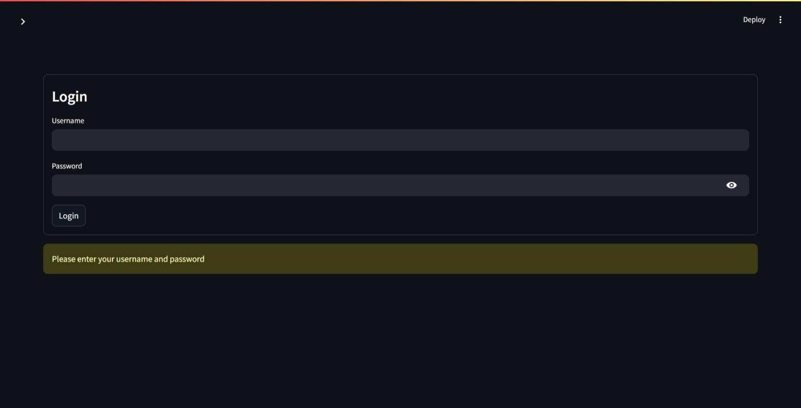

# Analytical System for Marketing Decision Support

## Overview

This project focuses on developing an **Analytical System for Marketing Decision Support**. The system leverages **data analytics, machine learning, and visualization tools** to help the marketing team make **data-driven decisions**. It provides insights into **customer behavior, sales performance, campaign effectiveness**, and more.

## Objectives

The primary goal is to create a **Decision Support System (DSS)** that enables the marketing team to:

- **Gain customer insights** through segmentation, feedback analysis, and purchasing behavior.
- **Predict future trends** using **predictive analytics**.
- **Optimize marketing campaigns** by analyzing engagement, ROI, and campaign performance.
- **Allocate marketing resources effectively** using data-driven strategies.

## Key Features

### Customer Analysis
- Demographics, visit frequency, ratings, and product preferences.
- Sentiment analysis from customer reviews.


### Customer Segmentation
- Clustering customers based on behavior and demographics.
- Identifying high-value and frequent customers.


### Sales Analysis
- Revenue tracking across locations.
- Order volume and average order value trends.
- Sales performance over time.


### Campaign Performance
- Measuring **engagement, ROI, and conversion rates**.
- Forecasting campaign impact.


## Preview

The system includes an **interactive dashboard** that allows marketing teams to explore **customer trends, campaign effectiveness, and sales performance**.

**To run the application:**
   ```sh
   streamlit run app.py
   ```
**Username & password**: admin

